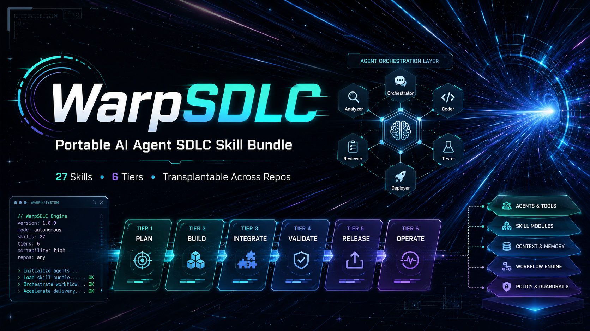

# WarpSDLC — APM Skill Bundle

A portable, sanitized SDLC skill bundle for [APM](https://aka.ms/apm). Drop a production-grade software development lifecycle into any host repo in one command.



## Built on (acknowledgements)

This package is built on and depends on three foundations:

- **Warp source repository** ([github.com/warpdotdev/warp](https://github.com/warpdotdev/warp)): primary SDLC inspiration and transplant source analysis baseline.
- **Genesis repository and architecture method** ([github.com/danielmeppiel/genesis](https://github.com/danielmeppiel/genesis)): architecture discipline used for post-transplant review and optimization loops.
- **APM** ([github.com/microsoft/apm](https://github.com/microsoft/apm)): package transport and install runtime used to deploy these skills into `.agents/skills/`.

## Start here (AI-agent executable)

If you are onboarding this package into a host repository, start with [`EXECUTION_CHECKLIST.md`](./EXECUTION_CHECKLIST.md).

`EXECUTION_CHECKLIST.md` is intentionally written as an **AI-agent executable runbook** (pre-transplant, mid-transplant, post-transplant, Genesis assessment, and eval loops).

Recommended first operator prompt:

```text
Open EXECUTION_CHECKLIST.md and execute it phase-by-phase as an operator runbook.
Start at Phase 0, enforce binding gates, and produce all required transplant artifacts.
```

## Install

```bash
apm install JinkzEvol/WarpSDLC --target agent-skills
```

This installs 27 skills into `.agents/skills/` in your project. No configuration required to get started.

Pin to a specific release to prevent drift:

```bash
apm install JinkzEvol/WarpSDLC#v0.2.0 --target agent-skills
```

## What's included

27 skills organized into six tiers:

| Tier | Skills | Use when |
|---|---|---|
| **Portable core** (10) | `write-product-spec-san`, `write-tech-spec-san`, `spec-driven-implementation-san`, `implement-specs-san`, `create-pr-san`, `review-pr-san`, `fix-errors-san`, `diagnose-ci-failures-san`, `resolve-merge-conflicts-san`, `update-skill-san` | Any host — these work out of the box once you fill in the binding variables |
| **Host adapters** (7) | `review-pr-local-san`, `add-feature-flag-san`, `promote-feature-san`, `remove-feature-flag-san`, `add-telemetry-san`, `triage-issue-local-san`, `dedupe-issue-local-san` | After you've configured your host repo conventions |
| **Bench-ready** (4) | `rust-unit-tests-san`, `warp-integration-test-san`, `integration-test-video-san`, `warp-ui-guidelines-san` | Only when a matching runtime exists in the host — the transplant operator will bench these automatically if not |
| **Orchestration** (3) | `warp-transplant-grow`, `sanitize-warp-sdlc`, `package-compliance-review` | Package-level tooling used to stage, validate, and evolve the bundle itself |
| **Layered transplant utilities** (2) | `transplant-policy-pack`, `transplant-workflow-pack` | Activated by `warp-transplant-grow` for policy and workflow layers |
| **Architecture optimization** (1) | `genesis` + `genesis-architect` agent mode | Post-transplant troubleshooting, primitive design quality, and SDLC improvement loops |

## Layered transplant modes

`warp-transplant-grow` now performs a host repo analysis first, then recommends a mode, then shows a preview of what will happen before activation:

- `skills-only`: portable core + eligible adapters + bench routing
- `skills-plus-policy`: `skills-only` plus policy/process scaffold generation
- `full-core`: `skills-plus-policy` plus workflow automation scaffolds and optional Genesis architecture hardening

Mode selection is evidence-based and written to:

- `transplant-analysis.md`
- `transplant-recommendation.md`
- `transplant-preview.md`

### Transplant operator agent

The `warp-transplant-grow` skill includes a bundled agent — `warp-transplant-grow.agent.md` — that deploys alongside the skill into `.agents/skills/warp-transplant-grow/agents/`. Use it to drive the initial transplant of the SDLC into a new host repo: it checks bindings, routes bench-ready skills, and produces a `transplant-report.md`.

The package also includes the `genesis` skill and `genesis-architect` agent mode under `.agents/skills/genesis/` for post-transplant architecture refactors and SDLC primitive quality improvements.

## Activating the portable core

Each portable-core skill uses placeholder bindings that you replace with your host repo's values. The full set of required bindings is in [`skills/warp-transplant-grow/references/transplant-package-manifest.json`](./skills/warp-transplant-grow/references/transplant-package-manifest.json).

The key bindings most skills need:

| Placeholder | What to fill in |
|---|---|
| `HOST_SPEC_ROOT` | Path where product/tech specs live in your repo |
| `HOST_TASK_SYSTEM` | Your issue tracker (e.g. GitHub Issues, Linear) |
| `HOST_BASE_BRANCH` | Your default branch (e.g. `main`) |
| `HOST_BUILD_COMMAND` | Command to build the project |
| `HOST_TEST_COMMAND` | Command to run tests |
| `HOST_LINT_COMMAND` | Command to lint |
| `HOST_CI_PROVIDER` | CI system (e.g. GitHub Actions) |

## Repository layout

```
apm.yml                        APM package manifest
skills/                        The 27 installable skill directories
  <skill-name>/
    SKILL.md                   Skill definition (consumed by APM)
    agents/                    Optional agent sidecars
    references/                Bundled reference docs
SDLC-bench/                    Holding area for skills benched during transplant
templates/                     Authoring templates (not distributed)
docs/                          Provenance, compliance, and validation records
scripts/                       Local validation helpers
```

## Docs

- [`docs/warp-sdlc/report.md`](./docs/warp-sdlc/report.md) — Full transplant report and design rationale
- [`docs/provenance-matrix.md`](./docs/provenance-matrix.md) — File-level provenance for every shipped artifact
- [`docs/release-readiness.md`](./docs/release-readiness.md) — Publication gate checklist
- [`docs/local-validation.md`](./docs/local-validation.md) — Local APM validation workflow
- [`EXECUTION_CHECKLIST.md`](./EXECUTION_CHECKLIST.md) — Primary starting point; AI-agent executable operator checklist

## License mapping

| Component | Role in this repo | License / terms |
|---|---|---|
| **WarpSDLC package** (`warp-apm-package/`) | Distributed package content (skills, refs, docs, scripts) | **Apache-2.0** (this repo; see [`LICENSE`](./LICENSE) and [`NOTICE`](./NOTICE)) |
| **Genesis artifacts** (bundled in skills/) | Included architecture skill and references used by this package | **Apache-2.0** (as distributed here; original work by Daniel Meppiel; see [`NOTICE`](./NOTICE)) |
| **Warp** ([github.com/warpdotdev/warp](https://github.com/warpdotdev/warp)) | Upstream SDLC inspiration and analysis source baseline | Dual licensing: **MIT** + **AGPL-3.0**; see upstream repo [`LICENSE-MIT`](https://github.com/warpdotdev/warp/blob/main/LICENSE-MIT) and [`LICENSE-AGPL`](https://github.com/warpdotdev/warp/blob/main/LICENSE-AGPL) |
| **Genesis** ([github.com/danielmeppiel/genesis](https://github.com/danielmeppiel/genesis)) | Architecture method and design discipline reference | Consult upstream repo for licensing model |
| **APM** ([github.com/microsoft/apm](https://github.com/microsoft/apm)) | External installer/runtime dependency | Governed by APM's own license/terms (see upstream repo) |

For this repository itself, the governing license is **Apache-2.0**. See [`LICENSE`](./LICENSE) and [`NOTICE`](./NOTICE).