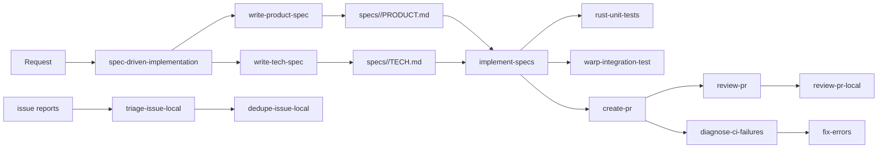
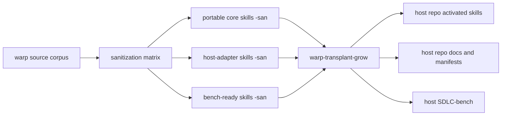

# How The AI SDLC Primitives Work Together

The Warp AI SDLC system is a layered package, not a single skill.

## Lanes

1. Specification lane: `spec-driven-implementation`, `write-product-spec`, and
   `write-tech-spec` turn an ambiguous request into checked-in specs.
2. Build lane: `implement-specs`, `fix-errors`, `rust-unit-tests`,
   `warp-integration-test`, and feature-flag skills turn approved specs into a
   releasable change.
3. Review lane: `create-pr`, `review-pr`, and `review-pr-local` create and gate
   review artifacts.
4. Issue lane: `triage-issue-local` and `dedupe-issue-local` adapt a core issue
   workflow to the local repo.
5. Runtime lane: `.warp/workflows/*` gives developers short entrypoints for the
   most common local SDLC commands.

## System diagram

## Sanitized transplant model

## How to use the package in another repo

1. Sanitize first. Replace Warp repo names, paths, and conventions with
   placeholders rather than trying to copy them through unchanged.
2. Bind host placeholders. Decide the host repo's spec root, validation
   commands, PR template, issue labels, review output contract, and feature-flag
   model.
3. Run a binding audit. If any portable-core placeholder is unresolved, stop and
   write a blocked `transplant-report.md` instead of partially activating the
   package.
4. Grow the host package in dependency order. Portable core skills activate
   first, then host-adapter skills, then conditional or bench-ready skills.
5. Bench what does not fit. If the host lacks a comparable feature-flag system,
   integration-test harness, or local issue core, preserve the sanitized module
   under `SDLC-bench/` instead of forcing a broken install.

The authoritative package graph for transplant-time dependency and binding
decisions lives in `transplant-package-manifest.json` at the package root.