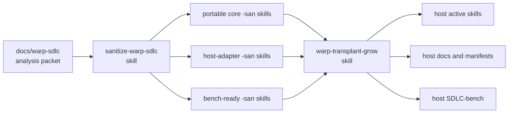
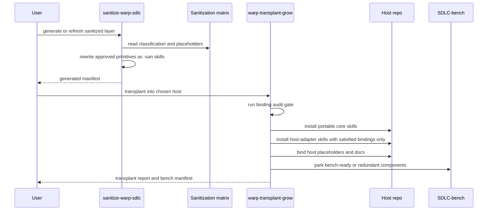

# Genesis Design Packet For The Transplant Package

## Intent

Build a host-neutral SDLC package from the Warp-only SDLC primitive set without
copying repo-specific Warp guidance into the shipped package. The package must
preserve unsupported or redundant primitives under `SDLC-bench/` instead of
dropping them.

## Component diagram

## Sequence diagram

## Required interlock

Portable-core activation is blocked until the binding audit closes every
required placeholder named by the package manifest. If the audit fails, the
operator writes `transplant-report.md` and stops without partial activation.