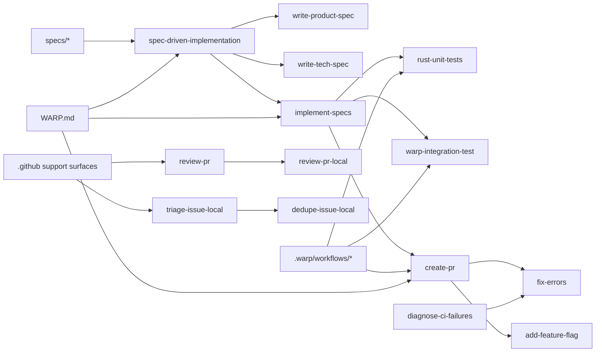

# Warp SDLC Primitive Inventory

Scope: `../warp/` only.

A primitive is included here when it steers planning, implementation,
validation, review, issue handling, release flow, or repo automation.

## Map

## AI SDLC skills

| Primitive | Source path | Role | Inputs | Outputs | Depends on | Portability |
| --- | --- | --- | --- | --- | --- | --- |
| `add-feature-flag` | `../warp/.agents/skills/add-feature-flag/SKILL.md` | Adds gated rollout scaffolding | feature name, target scope | feature gate changes | host flag registry, app config | host-adapter |
| `add-telemetry` | `../warp/.agents/skills/add-telemetry/SKILL.md` | Adds instrumentation | event intent, flow anchor | telemetry events | host telemetry stack | host-adapter |
| `create-pr` | `../warp/.agents/skills/create-pr/SKILL.md` | Opens or updates a validated PR | branch state, validation evidence | PR metadata, PR updates | GitHub CLI, PR template, validation commands | portable core |
| `dedupe-issue-local` | `../warp/.agents/skills/dedupe-issue-local/SKILL.md` | Repo-specific duplicate issue overlay | two issues, labels | duplicate decision | missing core `dedupe-issue`, host labels | host-adapter |
| `diagnose-ci-failures` | `../warp/.agents/skills/diagnose-ci-failures/SKILL.md` | Reads failing CI and emits a repair plan | PR context, CI logs | plan artifact | GitHub CLI, `fix-errors` | portable core |
| `fix-errors` | `../warp/.agents/skills/fix-errors/SKILL.md` | Repairs failing checks | failing command, logs | corrected code or plan | build, lint, test commands | portable core |
| `implement-specs` | `../warp/.agents/skills/implement-specs/SKILL.md` | Builds from approved specs | `PRODUCT.md`, `TECH.md` | code, updated specs | spec pair, tests, PR flow | portable core |
| `promote-feature` | `../warp/.agents/skills/promote-feature/SKILL.md` | Advances feature rollout | flag id, rollout stage | updated rollout config | host channel model | host-adapter |
| `remove-feature-flag` | `../warp/.agents/skills/remove-feature-flag/SKILL.md` | Removes stale gates | flag id | cleaned code, removed gate | host feature-gate system | host-adapter |
| `resolve-merge-conflicts` | `../warp/.agents/skills/resolve-merge-conflicts/SKILL.md` | Resolves code conflicts | conflicted files | merged files | git, language compiler | portable core |
| `review-pr` | `../warp/.agents/skills/review-pr/SKILL.md` | Writes machine-readable PR review output | `pr_diff.txt`, `pr_description.txt` | `review.json` | diff artifact generator, JSON validator | portable core |
| `review-pr-local` | `../warp/.agents/skills/review-pr-local/SKILL.md` | Repo-specific review overlay | core review inputs, repo rules | repo-tuned review guidance | `review-pr`, `WARP.md`, PR media policy | host-adapter |
| `rust-unit-tests` | `../warp/.agents/skills/rust-unit-tests/SKILL.md` | Writes Rust unit tests | module path, behavior | Rust tests | Rust toolchain, test layout | conditional portable |
| `spec-driven-implementation` | `../warp/.agents/skills/spec-driven-implementation/SKILL.md` | Orchestrates spec-first delivery | feature request | spec package, implementation lane | task system, spec pair | portable core |
| `triage-issue-local` | `../warp/.agents/skills/triage-issue-local/SKILL.md` | Repo-specific issue triage overlay | issue report, label taxonomy | labels, routing hints | missing core `triage-issue`, host labels | host-adapter |
| `update-skill` | `../warp/.agents/skills/update-skill/SKILL.md` | Revises skill modules | skill target, feedback | updated skill guidance | skill layout, validator | portable core |
| `warp-integration-test` | `../warp/.agents/skills/warp-integration-test/SKILL.md` | Writes Warp-specific integration tests | test behavior, harness context | test files, registrations | Warp integration harness | bench-ready |
| `warp-ui-guidelines` | `../warp/.agents/skills/warp-ui-guidelines/SKILL.md` | Encodes Warp UI conventions | UI task context | design-system guidance | WarpUI-specific surfaces | bench-ready |
| `write-product-spec` | `../warp/.agents/skills/write-product-spec/SKILL.md` | Writes user-facing behavior specs | feature summary, user intent | `PRODUCT.md` | task id, design inputs | portable core |
| `write-tech-spec` | `../warp/.agents/skills/write-tech-spec/SKILL.md` | Writes technical implementation specs | approved product behavior, code context | `TECH.md` | `PRODUCT.md`, validation plan | portable core |

## Workflow and runtime surfaces

| Primitive | Source path | Role | Inputs | Outputs | Portability |
| --- | --- | --- | --- | --- | --- |
| `integration-test-video` | `../warp/.warp/skills/integration-test-video/SKILL.md` | Captures video and screenshot evidence for integration tests | test id, artifact flags | media artifacts | bench-ready |
| `start_new_task` | `../warp/.warp/workflows/start_new_task.yaml` | Creates a clean feature branch | branch name | checked-out branch | host-adapter |
| `run_unit_test` | `../warp/.warp/workflows/run_unit_test.yaml` | Runs a focused unit test | module and test id | targeted test output | host-adapter |
| `run_integration_test` | `../warp/.warp/workflows/run_integration_test.yaml` | Runs a focused integration test | test id | targeted integration output | bench-ready |
| `run_warp_with_shell` | `../warp/.warp/workflows/run_warp_with_shell.yaml` | Launches app with shell override | shell id | local manual test session | bench-ready |
| `run_warp_with_version_and_channel` | `../warp/.warp/workflows/run_warp_with_version_and_channel.yaml` | Launches app with version/channel override | version, channel | local manual test session | bench-ready |
| `create_feature_release_pr` | `../warp/.warp/workflows/create_feature_release_pr.yaml` | Starts release PR flow | release metadata | PR-ready branch | host-adapter |
| `copy_keychain_to_warp_local` | `../warp/.warp/workflows/copy_keychain_to_warp_local.yaml` | Local workstation helper | machine-specific paths | copied credentials/material | blocked |
| `cherrypick_into_release` | `../warp/.warp/workflows/cherrypick_into_release.yaml` | Cherry-picks release fixes | commit ids | updated release branch | host-adapter |
| `build_image_and_start_container_for_ssh_testing` | `../warp/.warp/workflows/build_image_and_start_container_for_ssh_testing.yaml` | Builds local SSH test container | Docker context | running container | bench-ready |
| `script_bundle_temp` | `../warp/.warp/workflows/script_bundle_temp.yaml` | Temporary developer helper | ad hoc arguments | ad hoc output | blocked |

## SDLC families and repo guidance

| Primitive | Source path | Role | Inputs | Outputs | Portability |
| --- | --- | --- | --- | --- | --- |
| `spec corpus` | `../warp/specs/*` | Stores checked-in `PRODUCT.md` and `TECH.md` specs | ticket or feature id | versioned specs | portable core |
| `WARP.md` | `../warp/WARP.md` | Repo-wide development and review guidance | current repo state | operator constraints, commands, patterns | host-adapter |
| `PR review workflow` | `../warp/.github/workflows/update-pr-review-local.yml` | Refreshes local review overlay guidance | scheduled/manual trigger | updated local review guidance | bench-ready |
| `issue triage workflow` | `../warp/.github/workflows/update-triage-local.yml` | Refreshes local triage guidance | scheduled/manual trigger | updated local triage guidance | bench-ready |
| `issue dedupe workflow` | `../warp/.github/workflows/update-dedupe-local.yml` | Refreshes local dedupe guidance | scheduled/manual trigger | updated local dedupe guidance | bench-ready |

## Exact spec-family note

The `specs/` tree contains a large set of ticket or feature keyed folders,
usually with `PRODUCT.md` and `TECH.md` siblings. The family matters more than
the individual feature documents for transplant purposes, so the transplant
package preserves the directory convention rather than attempting to ship the
upstream spec corpus.