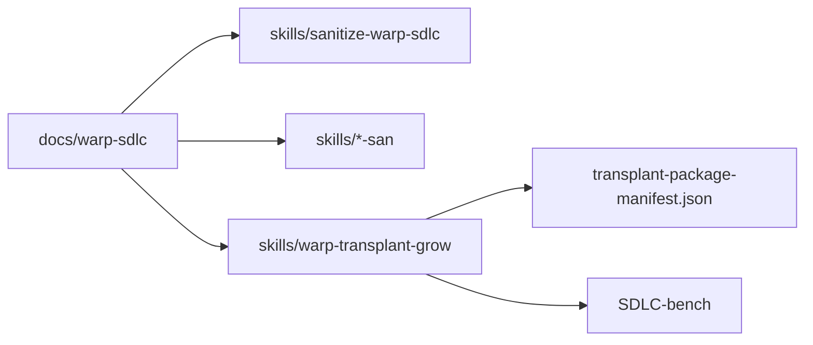

# Warp SDLC Transplant Report

## Scope

This report inventories the Warp-only SDLC primitives in `../warp/`, explains
how the AI SDLC package works after sanitization, and records the staged
transplant package created in `warp-apm-package/`.

## What happened

1. Built a Warp-only SDLC inventory and supporting non-AI dependency inventory.
2. Classified the primitive set into portable core, host-adapter, bench-ready,
   and blocked surfaces.
3. Rewrote the selected skill layer into original `-san` skills with explicit
   host placeholder comments.
4. Created the `sanitize-warp-sdlc` skill to refresh that sanitized layer.
5. Created the `warp-transplant-grow` skill and agent pair to bind host
   placeholders, activate supported skills, and preserve unresolved components
   in `SDLC-bench/`.
6. Ran `genesis-architect` review, fixed the reported contract and binding-gate
   gaps, and saved the final architecture verdict.
7. Declared the transplant operator agent in `transplant-package-manifest.json`
   and localized the runtime references needed for repeatable local APM tests.

## Package map

## Inventory summary

- Upstream AI skill surfaces inventoried: 20 under `../warp/.agents/skills/`
- Upstream runtime workflow surfaces inventoried: 10 under `../warp/.warp/workflows/`
- Upstream runtime skill surfaces inventoried: 1 under `../warp/.warp/skills/`
- SDLC family preserved as convention, not copied corpus: `../warp/specs/*`
- New sanitized skills created: 21
- New orchestration skills created: 2
- New staging docs created under `docs/warp-sdlc/`: 9

## Where the files are

Analysis and architecture:

- `docs/warp-sdlc/README.md`
- `docs/warp-sdlc/primitive-inventory.md`
- `docs/warp-sdlc/non-ai-primitives.md`
- `docs/warp-sdlc/ai-sdlc-system.md`
- `docs/warp-sdlc/sanitization-matrix.md`
- `docs/warp-sdlc/placeholder-catalog.md`
- `docs/warp-sdlc/genesis-design-packet.md`
- `docs/warp-sdlc/genesis-architect-review.md`
- `docs/warp-sdlc/report.md`

Sanitize and transplant spine:

- `skills/sanitize-warp-sdlc/`
- `skills/warp-transplant-grow/`
- `skills/warp-transplant-grow/agents/warp-transplant-grow.agent.md`
- `transplant-package-manifest.json`

Sanitized skill layer:

- `skills/*-san/` for the full sanitized skill set

Bench holding area:

- `SDLC-bench/`
- `SDLC-bench/manifests/initial-benched-primitives.md`

## How the sanitized SDLC works in a new repo

The portable-core skills provide the spec, implementation, repair, and review
spine. The host-adapter skills add repo-local overlays once the host bindings
exist. The bench-ready skills remain available, but the transplant operator only
activates them if the host exposes a matching runtime such as a Rust test stack,
integration-test harness, or UI framework.

The authoritative activation contract is the root `transplant-package-manifest.json`.
`warp-transplant-grow` uses that manifest plus the binding audit to decide which
skills activate, which are deferred, and which are parked in `SDLC-bench/`.

## Final status

- Skill validation: passing with 24 skill directories
- Architecture review: passing after follow-up fixes
- Local APM prepublish smoke test: scripted and repeatable
- Package is staged for local install validation, not public publication